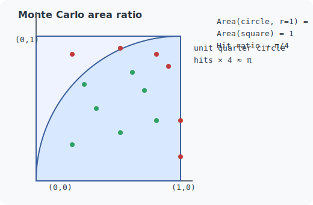
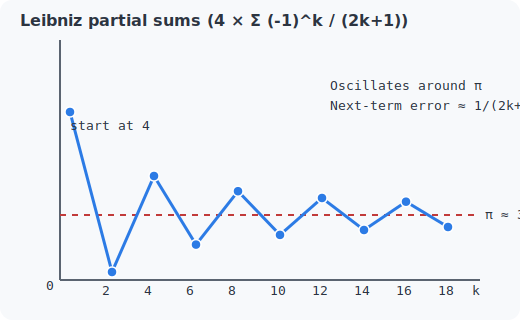

# PI Benchmark (Rust)

Simple cross-platform PI benchmark written in Rust with two modes:
- **Single-threaded Leibniz series**: CPU-bound floating point workload.
- **Multi-threaded Monte Carlo**: Embarrassingly parallel random sampling workload.

This is a hobby project meant for learning. Results are not intended for professional benchmarking.

## Requirements
- Rust toolchain (tested with stable, install via https://rustup.rs/)
- macOS, Linux, or Windows

## Quick start
```bash
# Single-threaded Leibniz (default 30,000,000,000 iterations)
cargo run --release -- single

# Monte Carlo (default 150,000,000,000 samples, auto thread count)
cargo run --release -- monte
```
On Windows PowerShell, you can also run the helper scripts:
```powershell
.\scripts\run_single.ps1
.\scripts\run_monte.ps1
```

## Scripts for easy runs
- Bash (macOS/Linux):
  - `scripts/run_single.sh` — runs the Leibniz benchmark. Override iterations with `PI_ITERATIONS`.
  - `scripts/run_monte.sh` — runs the Monte Carlo benchmark. Override samples/threads/seed with `PI_SAMPLES`, `PI_THREADS`, `PI_SEED`.
  - `scripts/run_all.sh` — runs both with their defaults.
- PowerShell (Windows):
  - `scripts/run_single.ps1` — runs the Leibniz benchmark. Override iterations with `PI_ITERATIONS`.
  - `scripts/run_monte.ps1` — runs the Monte Carlo benchmark. Override samples/threads/seed with `PI_SAMPLES`, `PI_THREADS`, `PI_SEED`.
  - `scripts/run_all.ps1` — runs both with their defaults.

Examples:
```bash
PI_ITERATIONS=75000000 ./scripts/run_single.sh
PI_SAMPLES=300000000 PI_THREADS=8 ./scripts/run_monte.sh
```
```powershell
$env:PI_ITERATIONS=75000000; .\scripts\run_single.ps1
$env:PI_SAMPLES=300000000; $env:PI_THREADS=8; .\scripts\run_monte.ps1
```

## CLI usage
```
pi-benchmark <mode> [options]

Modes:
  single        Single-threaded Leibniz series
  monte         Multi-threaded Monte Carlo
```

### Single-threaded options
- `--iterations`, `-n` — number of series iterations (default: 30,000,000,000).
- `--save-json <path>` — append this run to a JSON file (created automatically if missing).
- `--notes <text>` — attach free-form notes (e.g. "Before heatsink replacement").

### Monte Carlo options
- `--samples`, `-s` — total random points to generate (default: 150,000,000,000).
- `--threads`, `-t` — worker threads (default: system parallelism).
- `--seed` — RNG seed for reproducible runs.
- `--save-json <path>` — append this run to a JSON file (created automatically if missing).
- `--notes <text>` — attach free-form notes (e.g. "After fan swap").

Each saved JSON entry records the timestamp, work performed, PI estimate/error, elapsed time, throughput, and a system profile (OS, CPU model/architecture/frequency, core counts, RAM, and a best-effort hardware guess). Existing files that contain a single JSON object are automatically upgraded to arrays when appending.

## What the modes do
- **Leibniz**: Computes `pi` via `4 * Σ (-1)^k / (2k + 1)` in a tight, single-threaded loop. Heavy on floating point and branch prediction.
- **Monte Carlo**: Generates random `(x, y)` pairs in the unit square across multiple threads and counts hits inside the unit circle. Each thread uses an independent LCG-based RNG seed.

## How the methods approximate pi (built from first principles)



### Monte Carlo (geometry → probability)
- Start with the definition of `pi`: it is the ratio of a circle's circumference to its diameter. For a unit circle (`r = 1`), the area formula `A = pi * r^2` collapses to `A = pi`.
- Draw a unit square from `(0, 0)` to `(1, 1)`. The quarter of the unit circle that fits in the square has area `pi / 4`, while the square has area `1`. The probability that a uniformly random point lands inside the quarter-circle is therefore `pi / 4`.
- The estimator mirrors that logic: generate uniform `x, y ∈ [0, 1)`, count a hit when `x^2 + y^2 <= 1`, and compute `pi ≈ 4 * hits / samples`. By the law of large numbers, the hit ratio converges to the true area ratio as samples grow.
- Error shrinks with `1 / sqrt(n)` (a consequence of variance in a Bernoulli process), so cutting error in half requires roughly 4× more samples. The defaults are intentionally huge to get into the low-error regime and to provide a substantial workload.
- The RNG is a tiny linear congruential generator (LCG) scrambled into the `f64` mantissa for speed. Each thread starts with a different seed to keep streams independent; threads simply split the total sample budget and sum their hit counts.
- The diagram above shows the geometric setup: area ratio `→` probability `→` estimate.



### Leibniz series (algebra → calculus)
- Start with the derivative identity `d/dx arctan(x) = 1 / (1 + x^2)`. Expanding `1 / (1 + x^2)` as a geometric series around `x = 0` gives `1 - x^2 + x^4 - x^6 + ...`. Integrating term-by-term yields the Taylor series `arctan(x) = x - x^3/3 + x^5/5 - x^7/7 + ...`.
- Evaluating at `x = 1` uses the angle fact `arctan(1) = pi / 4`, producing `pi / 4 = 1 - 1/3 + 1/5 - 1/7 + ...`, or `pi = 4 * Σ (-1)^k / (2k + 1)`.
- The alternating series test says the error after `n` terms is bounded by the magnitude of the next term (`~1/(2n+3)`). That is slow convergence, which makes this series a deterministic but heavy CPU workload: lots of adds, subtracts, and divides with minimal memory traffic.
- Every term depends on the accumulated sum, so the computation is naturally single-threaded; the benchmark intentionally keeps it that way to stress branch prediction and floating-point throughput without parallelism.
- The plot above shows the first few partial sums bouncing around `pi` and gradually closing in as more terms are added.

## Tips
- Use `--release` for meaningful performance numbers (debug builds are much slower).
- Pin thread counts (`--threads`) when comparing across machines to avoid differences from SMT or OS scheduling.
- For reproducible Monte Carlo runs, supply an explicit `--seed` or `PI_SEED`.

## Project layout
- `src/main.rs` — CLI and benchmark implementations.
- `scripts/` — convenience runners for macOS/Linux shells.
- `dashboard/` — static dashboard that renders aggregated JSON results.
- `results/` — optional folder to collect run outputs before publishing to Pages.
- `Cargo.toml` — crate metadata and release profile tuned for benchmarking (LTO, single codegen unit).

## Dashboard & GitHub Pages
- Save runs with `--save-json results/my-machine.json` to build a local collection (files are appended automatically).
- The GitHub Actions workflow (`.github/workflows/pages.yml`) aggregates every JSON file under `results/` into `site/data/results.json` and publishes the dashboard to GitHub Pages. If no results are present, it falls back to `dashboard/data/sample_results.json` so the page still loads.
- Open `dashboard/index.html` locally or visit your repository's Pages URL to explore tables and charts for all recorded runs.
- To publish: push to `main` (or trigger the workflow manually). In the repo settings, enable GitHub Pages with the "GitHub Actions" source once; subsequent runs deploy automatically to the Pages environment.

## Testing
```bash
cargo test
```

## Notes
This is a learning tool. For rigorous benchmarking, consider dedicated suites and account for system noise, thermal throttling, and background load.
